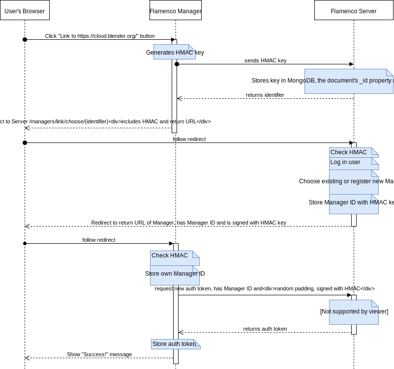

# Linking Managers

Managers can semi-automatically link to a Flamenco Server.

1. User intiates the linking process by providing the server URL.
2. Manager generates a secret key and sends it to the Server. This key is used in subsequent
   communication between Manager and Server to authenticate both parties.
3. Server stores this key in a document in MongoDB, which gives the document an `_id` field. This is
   returned to Flamenco Manager so that it can identify itself later on.
4. Manager redirects the browser to the Server, to a URL that includes its `_id`. It also uses HMAC
   to sign the URL so that the Server can verify that this link was generated on the Manager
   identified by the `_id`.
5. Server allows the user to log in (if not already logged in). After login it presents a choice of
   already registered Managers, together with a "name" field to create a new one.
6. User chooses a Manager or registers a new one. Either way, this results in a Manager ID.
7. Server redirects the browser back to Manager, with the Manager ID included in the URL. It also
   uses HMAC to sign the URL so that Manager can verify this Manager ID originated from the correct
   Server.
8. Manager stores its own Manager ID, and requests an authentication token reset. Again this request
   is signed using HMAC.
9. Server verifies the request, removes all previously existing authentication tokens, generates a
   new one, and includes that in the response.
10. Manager stores the authentication token and displays a success message.

An index on the server's MongoDB collection ensures that secret keys are deleted after 15 minutes.

## Manager linking as UML timeline

