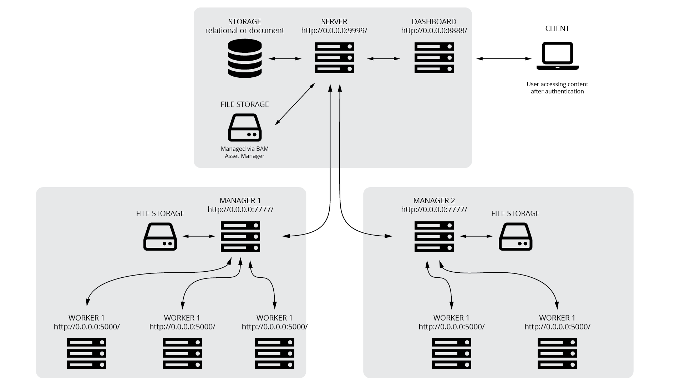

.. _architecture:

*******************
System Architecture
*******************

Brender architecture is is based on the following scheme. 
We have one server, one or more manager, controlling one or more workers,
and one dashboard.

With this configuration it's possible to have a very generic and simple 
API on the server, and develop/maintain different type of front-ends for it.

It could be argued that developing a unified version of server and dashboard
would make things more efficient, but on the other hand the development
of an API would be needed anyway.

Having dashboard and server separate also allows greater level of network
security, as well as more flexible maintainability (dashboard can go down
for changes and the server can keep running).

Manager double handshake
========================

Connection between workers and the manager is entirely automatic and follows
this procedure (assuming that the manager is up and running):

* worker starts up
* worker connects to the manager and sends identification info
* manager checks identification and updates worker status or adds worker to the database
* manager confirms connection to the worker
* worker notifies its availability to the manager
* manager checks current jobs and eventually assigns one to the worker

Render workflow
===============

The render workflow is based on jobs. Once a jobs is added to brender, we 
automatically create tasks (collection of commands) to send to any available
worker. 
When all tasks are completed, the job is marked as finished.

Frames
======

We need to get the frames framework set. Every frame rendered in brender 
gets saved in the database with the relative stats, frame address and 
a preview (the thumbnail).

Once a frame is rendered (as part of a job):

* save it in the designated location
* add an entry in the frames table
* generate a thumbnails via the worker who made them
* also save such thumbnails as part of the frame data?

Frame model:

* Shot ID
* Number
* Name
* Path (on server)
* Render Date
* Render Time

Thumbnail generation
====================

Thumbnails of each rendered frame are automatically generated in brender 
and are used for both static and animated previews of a shot.

As soon as a frame is saved on the shared storage controlled by the server,
it will be the server's duty to generate a thumbnail for it.

Used for:

* last frame rendered (to be displayed in the dashboard homepage)
* all frames of a shot (in the frames view)
* shot preview (single image and animation)

Thumbnail

    shot_id/frame_name_thumbnail.jpg (or png for transparency)
